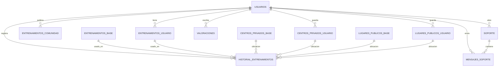

# 03 - Relaciones BD Visual y Teoria

Este documento es para memorizar y entender las relaciones de base de datos de forma visual. Si te preguntan por el diagrama ER, estudia este.

## Idea Madre

La base de datos gira alrededor de `usuarios`.

```text
                         USUARIOS
                            |
       -------------------------------------------------
       |        |        |        |       |      |      |
   mis entren. centros  lugares historial valor. soporte mensajes
```

Regla mental:

> Si algo es privado o creado por una persona, tiene `usuario_id`.

## Familias de Tablas

```text
IDENTIDAD
  usuarios

ENTRENAMIENTOS
  entrenamientos_base
  entrenamientos_usuario
  entrenamientos_comunidad

UBICACIONES
  centros_privados_base
  centros_privados_usuario
  lugares_publicos_base
  lugares_publicos_usuario

SEGUIMIENTO
  historial_entrenamientos
  estadisticas calculadas desde historial

OPINION
  valoraciones

SOPORTE
  soporte
  mensajes_soporte
```

## Base vs Usuario

Esta es la idea mas importante.

| Tipo | Significado | Ejemplo | Tiene `usuario_id` |
|---|---|---|---|
| `*_base` | Catalogo comun | `entrenamientos_base` | No |
| `*_usuario` | Dato personal | `entrenamientos_usuario` | Si |

Forma de recordarlo:

```text
BASE = de la app, para todos
USUARIO = mio, personalizado, con usuario_id
```

Ejemplos:

- `centros_privados_base`: gimnasios del catalogo.
- `centros_privados_usuario`: gimnasios guardados por un usuario.
- `lugares_publicos_base`: parques/rutas del catalogo.
- `lugares_publicos_usuario`: lugares guardados por un usuario.

## Diagrama ER Resumido



## Las 12 Tablas

| Tabla | Que es | Relacion clave |
|---|---|---|
| `usuarios` | Cuentas y roles | Tabla central |
| `entrenamientos_base` | Rutinas generales | Catalogo |
| `entrenamientos_usuario` | Rutinas personales | N:1 con usuarios |
| `entrenamientos_comunidad` | Rutinas publicadas | N:1 con usuarios |
| `centros_privados_base` | Gimnasios catalogo | Catalogo |
| `centros_privados_usuario` | Gimnasios guardados | N:1 con usuarios |
| `lugares_publicos_base` | Lugares catalogo | Catalogo |
| `lugares_publicos_usuario` | Lugares guardados | N:1 con usuarios |
| `historial_entrenamientos` | Actividad real | N:1 con usuarios y varias FK opcionales |
| `valoraciones` | Puntuaciones/comentarios | N:1 con usuarios + relacion logica |
| `soporte` | Tickets | N:1 con usuarios |
| `mensajes_soporte` | Mensajes de tickets | N:1 con soporte y usuarios |

## Usuarios: La Tabla Central

Entidad:

- `model/Auth/Usuario.java`

Tabla:

- `usuarios`

Campos:

- `id`
- `username`
- `email`
- `password`
- `rol`

Relaciones directas:

```text
usuarios 1:N entrenamientos_usuario
usuarios 1:N entrenamientos_comunidad
usuarios 1:N centros_privados_usuario
usuarios 1:N lugares_publicos_usuario
usuarios 1:N historial_entrenamientos
usuarios 1:N valoraciones
usuarios 1:N soporte
usuarios 1:N mensajes_soporte
```

Frase para tribunal:

> Usuario es el eje de la aplicacion. Todo lo privado o generado por una persona queda asociado con `usuario_id`.

## Entrenamientos

### Por que hay 3 tablas?

```text
entrenamientos_base       = rutinas oficiales de la app
entrenamientos_usuario    = rutinas privadas/copias del usuario
entrenamientos_comunidad  = rutinas publicadas por usuarios
```

Flujo mental:

```text
Base -> usuario lo copia -> queda en Mis entrenamientos
Usuario -> lo publica -> aparece en Comunidad
Comunidad -> otro lo copia -> queda en Mis entrenamientos de ese otro
```

Relaciones:

```text
usuarios 1:N entrenamientos_usuario
usuarios 1:N entrenamientos_comunidad
entrenamientos_base 1:N historial_entrenamientos
entrenamientos_usuario 1:N historial_entrenamientos
```

Pregunta posible:

"Por que no una sola tabla?"

Respuesta:

> Porque tienen responsabilidades distintas: catalogo general, datos privados y contenido compartido. Separarlo aclara permisos y evita mezclar datos de la app con datos personales.

## Ubicaciones

Hay dos tipos de ubicacion:

```text
centros privados = gimnasios/instalaciones de pago
lugares publicos = parques, rutas, pistas, playas
```

Y cada tipo tiene:

```text
base    = catalogo general
usuario = guardado/personalizado
```

Relaciones:

```text
usuarios 1:N centros_privados_usuario
usuarios 1:N lugares_publicos_usuario
centros_privados_base 1:N historial_entrenamientos
centros_privados_usuario 1:N historial_entrenamientos
lugares_publicos_base 1:N historial_entrenamientos
lugares_publicos_usuario 1:N historial_entrenamientos
```

Frase para tribunal:

> La app separa centros privados y lugares publicos porque representan realidades distintas, pero usa el mismo patron: catalogo base y copia/guardado del usuario.

## Historial: La Tabla Hub

El historial responde a:

> Quien hizo que entrenamiento, cuando, cuanto tiempo, y donde.

Entidad:

- `model/Entrenamientos/HistorialEntrenamientos.java`

Tabla:

- `historial_entrenamientos`

Campos relacionales:

```text
usuario_id
entrenamiento_base_id
entrenamiento_usuario_id
lugar_publico_base_id
lugar_publico_usuario_id
centro_privado_base_id
centro_privado_usuario_id
```

Por que tantas FK:

```text
Entrenamiento:
  base O usuario

Ubicacion:
  ninguna O centro base O centro usuario O lugar base O lugar usuario
```

Reglas:

- Debe haber un entrenamiento.
- No pueden ir entrenamiento base y usuario a la vez.
- Puede no haber ubicacion.
- Si hay ubicacion, solo una.
- Si es recurso de usuario, debe pertenecer al usuario autenticado.

Donde se valida:

- `HistorialEntrenamientosService.java`

Frase para tribunal:

> Historial es una tabla de hechos: registra la actividad real. Por eso alimenta estadisticas y se conecta con entrenamientos y ubicaciones.

## Estadisticas

No hay tabla propia de estadisticas importantes porque se calculan desde historial.

```text
historial_entrenamientos
  -> contar registros
  -> sumar duracion
  -> calcular promedio
  -> contar centros/lugares distintos
  -> obtener entrenamiento mas repetido
```

Ubicacion:

- `EstadisticasService.java`
- `EstadisticasRepository.java`

Frase:

> Las estadisticas son datos derivados; la fuente de verdad es el historial.

## Valoraciones: La Relacion Especial

`valoraciones` puede apuntar a muchos tipos de contenido.

Campos clave:

```text
usuario_id
puntuacion
comentario
tipo_valoracion
id_relacionado
```

Ejemplo:

```text
tipo_valoracion = ENTRENAMIENTO_BASE
id_relacionado = 5
```

Significa:

> Esta valoracion es sobre el entrenamiento base con id 5.

Otro ejemplo:

```text
tipo_valoracion = CENTRO_PRIVADO_USUARIO
id_relacionado = 2
```

Significa:

> Esta valoracion es sobre el centro privado de usuario con id 2.

Por que no hay FK directa:

Una FK normal solo apunta a una tabla. Aqui una valoracion puede apuntar a muchas tablas posibles. Por eso se usa relacion logica.

Ventajas:

- Una sola tabla para todas las valoraciones.
- Facil de listar y filtrar.
- Flexible para nuevos tipos.

Desventaja:

- La BD no garantiza por si sola que `id_relacionado` exista.
- Se valida en `ValoracionService`.

Restriccion unica:

```text
usuario_id + tipo_valoracion + id_relacionado
```

Significa:

> Un usuario solo puede tener una valoracion por contenido. Si vuelve a valorar, se actualiza.

## Soporte

```text
usuarios 1:N soporte
soporte 1:N mensajes_soporte
usuarios 1:N mensajes_soporte
```

Explicacion:

- Un usuario abre tickets.
- Un ticket tiene muchos mensajes.
- Cada mensaje tiene un emisor.

En `Soporte.java`:

```java
@OneToMany(mappedBy = "ticket", cascade = CascadeType.ALL, orphanRemoval = true)
private List<MensajeSoporte> mensajes;
```

Significado:

> Si se elimina un ticket, tambien se eliminan sus mensajes.

## Normalizacion

Si preguntan si esta normalizada:

Respuesta:

> Si, en general separa entidades por responsabilidad. No guardo listas dentro de usuarios; uso tablas relacionadas mediante claves foraneas. Por ejemplo, un usuario no tiene una columna "mis entrenamientos", sino registros en `entrenamientos_usuario` con `usuario_id`.

Ejemplos:

- Usuarios separados de entrenamientos.
- Tickets separados de mensajes.
- Catalogo base separado de datos personales.
- Historial separado como registro de actividad.

## Mini Mapa para Recordar

```text
USUARIO
  -> MIS entrenamientos
  -> MIS centros
  -> MIS lugares
  -> MI historial
  -> MIS valoraciones
  -> MIS tickets

BASE
  -> catalogos que todos consultan

HISTORIAL
  -> actividad real
  -> estadisticas

VALORACIONES
  -> tipo + id

SOPORTE
  -> ticket + mensajes
```

## Preguntas y Respuestas

### Por que `usuarios` tiene tantas relaciones?

Porque la app es personalizada: casi todo depende de quien ha iniciado sesion.

### Por que no mezclas base y usuario?

Porque base es catalogo comun y usuario es personal. Separarlo mejora permisos y claridad.

### Por que historial no tiene solo `ubicacion_id`?

Porque una ubicacion puede venir de cuatro tablas distintas: centro base, centro usuario, lugar base o lugar usuario.

### Es mala la relacion de valoraciones?

No necesariamente. Es flexible, pero tiene una desventaja: la integridad depende de validaciones en service, no de FK fisica.

### Que tabla alimenta estadisticas?

`historial_entrenamientos`.

