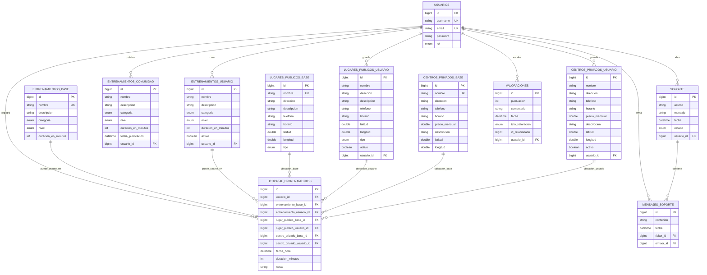

# Diagrama entidad-relacion - Digital Fit

Este diagrama resume las tablas principales y sus relaciones. Esta escrito en Mermaid, por lo que se puede visualizar en editores compatibles con Markdown Mermaid.

## Notas para defender el diagrama

- `USUARIOS` es la tabla central: casi todo lo privado pertenece a un usuario.
- Las tablas `*_BASE` son catalogos generales de la aplicacion.
- Las tablas `*_USUARIO` son elementos guardados o creados por un usuario concreto.
- `HISTORIAL_ENTRENAMIENTOS` concentra la actividad real del usuario y por eso alimenta las estadisticas.
- En historial, las FK hacia entrenamientos y ubicaciones son opcionales porque solo se selecciona una opcion de cada grupo.
- `VALORACIONES` tiene una relacion directa con `USUARIOS`, pero con el contenido valorado usa una relacion logica mediante `tipo_valoracion + id_relacionado`.
- La restriccion unica importante de `VALORACIONES` es: un usuario no puede valorar dos veces el mismo contenido del mismo tipo; si vuelve a valorar, se actualiza.

## Relacion logica de valoraciones

`VALORACIONES` puede apuntar conceptualmente a cualquiera de estas tablas:

- `ENTRENAMIENTOS_BASE`
- `ENTRENAMIENTOS_USUARIO`
- `ENTRENAMIENTOS_COMUNIDAD`
- `HISTORIAL_ENTRENAMIENTOS`
- `CENTROS_PRIVADOS_BASE`
- `CENTROS_PRIVADOS_USUARIO`
- `LUGARES_PUBLICOS_BASE`
- `LUGARES_PUBLICOS_USUARIO`

No aparece como FK fisica en el diagrama porque en codigo se resuelve con:

- `tipo_valoracion`: indica que tipo de contenido es.
- `id_relacionado`: guarda el id del contenido.
- `ValoracionService.validarContenidoExisteYPermisos`: comprueba existencia y permisos.

