# Diagrama Entidad-Relación - Digital-Fit

```mermaid
erDiagram
    USUARIO ||--o{ CENTRO_PRIVADO_USUARIO : "crea"
    USUARIO ||--o{ LUGAR_PUBLICO_USUARIO : "crea"
    USUARIO ||--o{ ENTRENAMIENTO_USUARIO : "crea"
    USUARIO ||--o{ ENTRENAMIENTO_COMUNIDAD : "publica"
    USUARIO ||--o{ HISTORIAL_ENTRENAMIENTOS : "realiza"
    USUARIO ||--o{ VALORACION : "valora"
    USUARIO ||--o{ SOPORTE : "abre ticket"
    USUARIO ||--o{ MENSAJE_SOPORTE : "envia"
    SOPORTE ||--o{ MENSAJE_SOPORTE : "contiene"

    HISTORIAL_ENTRENAMIENTOS o|--o| ENTRENAMIENTO_BASE : "relaciona"
    HISTORIAL_ENTRENAMIENTOS o|--o| ENTRENAMIENTO_USUARIO : "relaciona"
    HISTORIAL_ENTRENAMIENTOS o|--o| LUGAR_PUBLICO_BASE : "relaciona"
    HISTORIAL_ENTRENAMIENTOS o|--o| LUGAR_PUBLICO_USUARIO : "relaciona"
    HISTORIAL_ENTRENAMIENTOS o|--o| CENTRO_PRIVADO_BASE : "relaciona"
    HISTORIAL_ENTRENAMIENTOS o|--o| CENTRO_PRIVADO_USUARIO : "relaciona"

    USUARIO {
        Long id PK
        string username UK
        string email UK
        string password
        enum rol "USER | ADMIN"
    }

    CENTRO_PRIVADO_BASE {
        Long id PK
        string nombre UK
        string direccion
        string telefono
        string horario
        double precioMensual
        string descripcion
        double latitud
        double longitud
    }

    CENTRO_PRIVADO_USUARIO {
        Long id PK
        string nombre
        string direccion
        string telefono
        string horario
        double precioMensual
        string descripcion
        double latitud
        double longitud
        boolean activo
        Long usuario_id FK
    }

    LUGAR_PUBLICO_BASE {
        Long id PK
        string nombre UK
        string direccion
        string descripcion
        string telefono
        string horario
        double latitud
        double longitud
        enum tipo "PARQUE_PUBLICO, PLAYA_DEPORTIVA, PARQUE_CALISTENIA, CARRIL_BICI, ZONA_MULTIDEPORTE, RUTA_RUNNING, CIRCUITO_CICLISMO"
    }

    LUGAR_PUBLICO_USUARIO {
        Long id PK
        string nombre
        string direccion
        string descripcion
        string telefono
        string horario
        double latitud
        double longitud
        enum tipo
        boolean activo
        Long usuario_id FK
    }

    ENTRENAMIENTO_BASE {
        Long id PK
        string nombre UK
        string descripcion
        enum categoria "FUERZA_TOTAL, RUNNING, HIIT, FUERZA_TREN_INFERIOR, FUERZA_TREN_SUPERIOR, CALISTENIA_BASICA, MOVILIDAD, CICLISMO, CROSSFIT, RECUPERACION"
        enum nivel "PRINCIPIANTE, INTERMEDIO, AVANZADO"
        int duracionEnMinutos
    }

    ENTRENAMIENTO_USUARIO {
        Long id PK
        string nombre
        string descripcion
        enum categoria
        enum nivel
        int duracionEnMinutos
        boolean activo
        Long usuario_id FK
    }

    ENTRENAMIENTO_COMUNIDAD {
        Long id PK
        string nombre
        string descripcion
        enum categoria
        enum nivel
        int duracionEnMinutos
        datetime fechaPublicacion
        Long usuario_id FK
    }

    HISTORIAL_ENTRENAMIENTOS {
        Long id PK
        Long usuario_id FK
        Long entrenamiento_base_id FK
        Long entrenamiento_usuario_id FK
        Long lugar_publico_base_id FK
        Long lugar_publico_usuario_id FK
        Long centro_privado_base_id FK
        Long centro_privado_usuario_id FK
        datetime fechaHora
        int duracionMinutos
        string notas
    }

    VALORACION {
        Long id PK
        int puntuacion
        string comentario
        datetime fecha
        enum tipoValoracion
        Long idRelacionado
        Long usuario_id FK
    }

    SOPORTE {
        Long id PK
        string asunto
        string mensaje
        datetime fecha
        enum estado "ABIERTO, EN_PROCESO, CERRADO"
        Long usuario_id FK
    }

    MENSAJE_SOPORTE {
        Long id PK
        string contenido
        datetime fecha
        Long ticket_id FK
        Long emisor_id FK
    }
```

## Leyenda de Relaciones

| Relación | Tipo | Descripción |
|----------|------|-------------|
| || | Uno y solo uno |
| o| | Cero o uno |
| o{ | Cero o muchos |
| \|{ | Uno o muchos |

## Resumen de Relaciones

1. **Usuario → CentroPrivadoUsuario**: 1:N (Un usuario puede crear múltiples centros privados)
2. **Usuario → LugarPublicoUsuario**: 1:N (Un usuario puede crear múltiples lugares públicos)
3. **Usuario → EntrenamientoUsuario**: 1:N (Un usuario puede crear múltiples entrenamientos propios)
4. **Usuario → EntrenamientoComunidad**: 1:N (Un usuario puede publicar múltiples entrenamientos en comunidad)
5. **Usuario → HistorialEntrenamientos**: 1:N (Un usuario tiene múltiples registros de entrenamiento)
6. **Usuario → Valoracion**: 1:N (Un usuario puede hacer múltiples valoraciones)
7. **Usuario → Soporte**: 1:N (Un usuario puede abrir múltiples tickets de soporte)
8. **Soporte → MensajeSoporte**: 1:N (Un ticket contiene múltiples mensajes)
9. **Usuario → MensajeSoporte**: 1:N (Un usuario puede enviar múltiples mensajes)
10. **HistorialEntrenamientos → EntrenamientoBase**: N:1 (Opcional)
11. **HistorialEntrenamientos → EntrenamientoUsuario**: N:1 (Opcional)
12. **HistorialEntrenamientos → LugarPublicoBase**: N:1 (Opcional)
13. **HistorialEntrenamientos → LugarPublicoUsuario**: N:1 (Opcional)
14. **HistorialEntrenamientos → CentroPrivadoBase**: N:1 (Opcional)
15. **HistorialEntrenamientos → CentroPrivadoUsuario**: N:1 (Opcional)